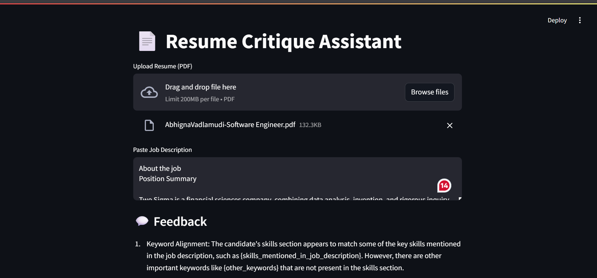

# Resume Critique Assistant (GenAI + spaCy + Streamlit)

This app analyzes your resume against a job description using a local LLM (Mistral via Ollama). It extracts sections with spaCy, scores alignment, and generates personalized improvement suggestions.

### Built With
- Python, spaCy (NLP resume parsing)
- LangChain + Ollama (LLM)
- Streamlit (UI)

### How to Run
pip install -r requirements.txt
streamlit run app.py

### Example Output:
Here’s a preview of the app in action:

💬 Feedback
Keyword Alignment (Medium): The resume includes several keywords found in the job description such as "data analysis," "project management," and "team leadership." However, some specific skills mentioned in the job description like "SQL" or "Tableau" are not explicitly listed in the candidate's skills section.

Skill Match (Medium): While the candidate has relevant experience in data analysis and project management, they do not have explicit experience with the more technical aspects of the job such as SQL and Tableau. The candidate also lacks formal education in a field directly related to the job description.

Tone and Formatting (Strong): The resume is well-structured and easy to read. The tone is professional, and the formatting is consistent throughout.

Summary Rating: Medium fit

Suggestions for improvement: To increase the fit between the candidate's profile and the job description, the following improvements can be made:

Expand the skills section to include more technical skills relevant to the job such as SQL and Tableau
Consider pursuing additional education or certifications in a field directly related to the job
Highlight any relevant experience with SQL and Tableau if the candidate has previously worked on projects where they used these tools, even if it was not their primary responsibility.